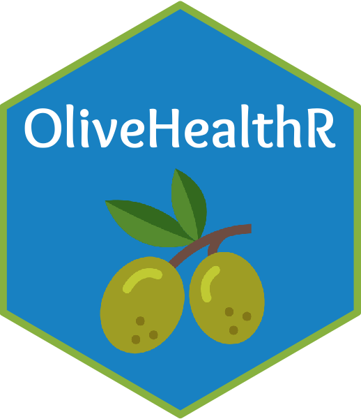
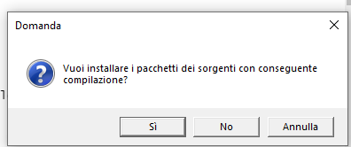

<!-- README.md is generated from README.Rmd. Please edit that file -->

# OliveHealthR 

<!-- badges: start -->

[](https://www.tidyverse.org/lifecycle/#stable)
<!-- badges: end -->

OliveHealthR è un software che svolge analisi sui dati provenienti dal
progetto OliveHealth. L’obiettivo principale del progetto è quello di
identificare le componenti salutistiche (es. polifenoli) in prodotti
della filiera olivicola (quali foglie, drupe e olio) correlandole alla
geo-localizzazione di ciascun appezzamento. Sulla base di queste
informazioni verranno prodotti dataset delle variabili rappresentative
delle principali caratteristiche fenotipiche, biochimiche e genetiche
associate all’ulivo dalle quali nascerà un database messo a disposizione
ai produttori olivicoli campani.Per maggiori informazioni sul progetto
clicca [qui](https://olivehealth.it).  

## Come si installa

OliveHealthR è un pacchetto creato utilizzando le librerie shiny di R e,
pertanto, per poter utilizzarlo bisogna installare i softwareR e
Rstudio. Se li hai già installati puoi saltare questi passaggi e andare
allo step 3.

### 1 Installazione dei software necessari

#### I. Installare R

Scarica e installa R da uno di questi link. Scegli in base al sistema
operativo utilizzato.

- **Windows:** <https://cran.r-project.org/bin/windows/base/>
- **OS:** <https://cran.r-project.org/bin/macosx/>
- **Ubuntu:** in questo caso segui la procedura qui descritta
  <https://www.r-bloggers.com/2013/03/download-and-install-r-in-ubuntu/>

#### II. Installa RStudio

Dopo aver installato R, installare RStudio. Apri il seguente link
<https://www.rstudio.com/products/rstudio/download/#download> e
scegliere la versione corrispondente al tuo sistema operativo.

#### III. Operazioni aggiuntive in base al sistema operativo

Per poter far funzionare correttamente il software è necessario eseguire
alcuni passaggi supplementari che cambiano in base al tuo sistema
operativo:

- **Solo per utenti Windows.**  
  Se sei un utente Windows è necessario installare anche Rtools
  utilizzando questo link:
  <https://cran.r-project.org/bin/windows/Rtools>. Se il tuo computer
  non ha Windows puoi tranquillamente saltare questo passaggio.

- **Solo per utenti MacOS (da controllare).**  
  Se sei un utente MacOS è necessario lanciare questa riga di comando
  dal Terminale del computer:

  ``` r
  brew install imagemagick@6
  ```

- **Solo per utenti Ubuntu (testato su 18.04).**  
  Se sei un utente Ubuntu bisogna installare delle librerie aggiuntive
  lanciando dal terminale le seguenti linee di codice:  

      sudo apt install build-essential libcurl4-gnutls-dev libxml2-dev libssl-dev
      sudo apt-get install libcairo2-dev
      sudo apt-get install libxt-dev
      sudo apt install libudunits2-dev
      sudo apt install libgdal-dev
      sudo apt install libmagick++-dev
      sudo apt-get install libc6

### 2. Installazione dei pacchetti di R

Ora che hai installato tutti i software necessari, avvia il programma
Rstudio. Al primo avvio la schermata iniziale è la seguente:


Tutti i codici di R che dovrai utilizzare nei passaggi seguenti dovranno
essere copiati e incollati nella parte evidenziata nella figura
precedente. Una volta incollati, per eseguire il comando basta premere
il tasto Invio.

Detto ciò, procediamo all’installazione del pacchetto OliveHealthR
lanciando i codici qui sotto:

``` r
if(!requireNamespace("devtools"))install.packages("devtools")
devtools::install_github("ShinyFabio/OliveHealthR")
```

Per farlo seleziona semplicemente le due righe di codice, incollale in
RStudio e premi Invio. Se esce un messaggio come questo nella figura
sottostante cliccare su <strong>No</strong>.



Il processo di installazione richiede qualche minuto. Al termine
OliveHealthR sarà pronto all’uso. Prima di avviare il software, puoi
decidere di installare tutte le immagini accessorie (cromatogrammi, foto
di drupe, foto di foglie etc.). Questo passaggio è facoltativo. Per
farlo lancia il codice qui sotto riportato:

``` r
OliveHealthR::download_photo()
```

### 3. Avvio di OliveHealthR

Arrivati a questo punto sei pronto per lanciare OliveHealthR. Esegui
semplicemente le due righe di codice qui riportate:

``` r
library(OliveHealthR)
OliveHealthR::run_OliveHealthR()
```

### 4. Aggiornamento

Qualora fossero disponibili versioni più aggiornate del software, per
eseguire l’aggiornamento è sufficiente lanciare questo codice:

``` r
devtools::update_packages("OliveHealthR", upgrade = "always")
```

Dopo che l’aggiornamento è completato, è necessario riscaricare le foto
(vedi step 2).
